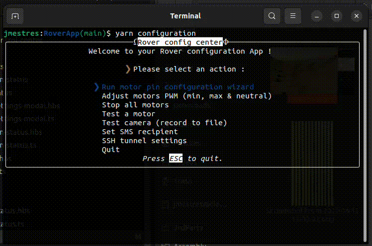

# Romgere's Exomy

Remote controlled (Wifi, 4g) 3D printed "Mars rover", inspired by [ESA - ExoMy project](https://github.com/esa-prl/ExoMy/)

## Freecad parts
All parts are editable in freecad.

## Control center application
Video stream, live camera settings updates, GPS position, lot of sensors & more.

## Configuration application
Easy configuration with the configuration Terminal Uer Interface.

# What changed

Here is a brief summary of what's change comparing to [original ExoMy project](https://esa-prl.github.io/ExoMy/) :

- Move rover code & UI app in this single mono-repo.
- Code source re-write :
  - Rover: Get rid of ROS & convert rover code typescript (based on Woker thread for better code isolation & error resilience)
  - Control app: Rewrite with [Ember.js](https://emberjs.com/) framework, add feature (Game controller support, new rover feature support, ...)
  - settings script has been rewritten in typescript into a TUI app using [ink](https://github.com/vadimdemedes/ink) (based on [React](https://fr.react.dev/))
- Add "some" feature to therover :
  - Send some measure from raspberry PI (Network quality, vcgencmd infos, ...)
  - Allow live camera settings update
  - Add some HTTP response (ping) to better deal with rover connection.
  - add sensor to rover & display values in UI (Lidar, Proximity, Magnetometer, Gyroscope)
  - add a 4g hat to allow controlling the rover from anywhere
  - add support for 4g hat built-in GPS & send live position to control app
  - add support for SMS (some usefull command, like enabling/disabling the SSH tunnel can be performed by sending SMS)
- Native ROS gamepad support has been replaced by using gamepad Api on UI app.
- Improvement of control app UI
- Convert all SolidWorks files to FreeCAD files & do a complete rewrite of the rover parts (see [Mechanical design Readme](./MechanicalDesign/README.md))
  - adapt part to new rover hardware (4g hat & sensor)
  - make it bigger ! ~150% original size
- More to come, see [todo](https://github.com/romgere/MyExoMy/wiki/ToDos)

# Where to start

Take a look to the Wiki : https://github.com/romgere/MyExoMy/wiki

If you start from scratch, you may want to go through the [assembling rover guide](https://github.com/romgere/MyExoMy/wiki/Assembling-the-Rover) or [software installation](https://github.com/romgere/MyExoMy/wiki/Software-installation).

ℹ️ The wiki is still Work In Progress, you can probably make an idea of the work that such project is needed by reading [the original ExoMy wiki](https://github.com/esa-prl/ExoMy/wiki)

# Control App

The control app (as it is on this repository `main` branch) is deployed on netlify. You can use it for your own conveniance if you want :

[https://rover.mestres.fr](https://rover.mestres.fr)

# Know issues

- Proximity sensors boxes need a re-design (proximity sensor lifght signal hit box & result in poor "far object" detection)
- New body height is still a bit small (servo connectors are a bit bended by top)
- 4G on/off commands (SMS) does not work (switching to GSM only make i2c & AT interface somehow exploding)
