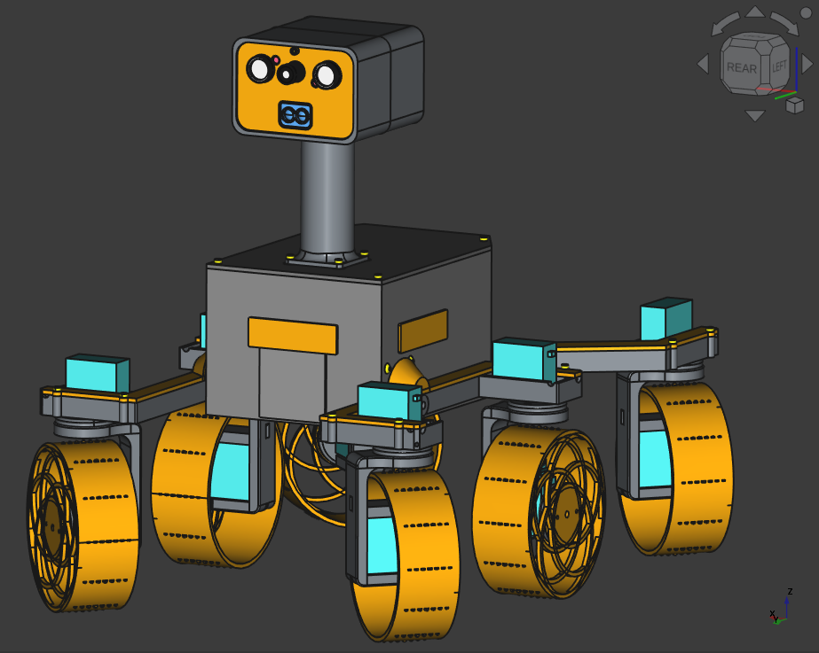
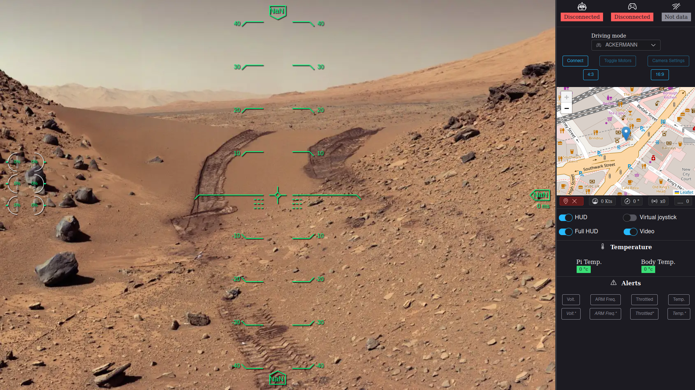
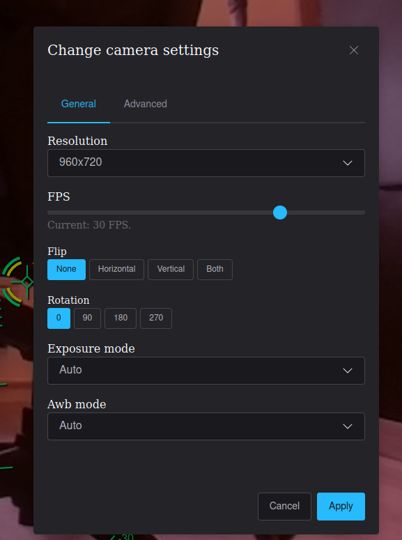
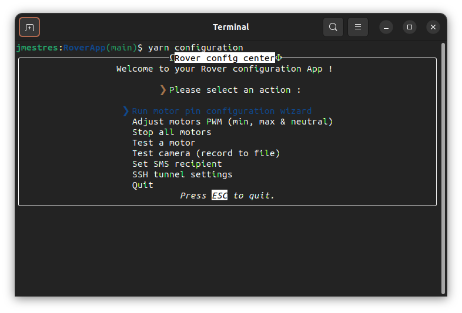

# Romgere's Exomy

Remote controlled (Wifi, 4g) 3D printed "Mars rover", inspired by [ESA - ExoMy project](https://github.com/esa-prl/ExoMy/)

## The rover

 

## Control Center

## Configuration application

# What changed

Here is a brief summary of what's change comparing to [original ExoMy project](https://esa-prl.github.io/ExoMy/) :

- Move rover code & UI app in this single mono-repo
- Code source re-write :
  - Rover: Get rid of ROS & convert rover code typescript.
  - Control app: Rewrite with [Ember.js](https://emberjs.com/) framework, add feature (Game controller support, new rover feature support, ...)
- Add feature to rover :
  - Add cheap servo workaround
  - Send some measure from raspberry PI (Network quality, vcgencmd infos, ...)
  - Allow live camera settings update
  - Add some HTTP response (ping) to better deal with rover connection.
  - add sensor to rover & display values in UI (Lidar, Proximity, Magnetometer, Gyroscope)
- Native ROS gamepad support has been replaced by using gamepad Api on UI app.
- Improvement of control app UI
- Convert all SolidWorks files to FreeCAD files & do a complete rewrite of the rover parts (see [Mechanical design Readme](./MechanicalDesign/README.md))
- Config scripts has been rewriten into a nodejs TUI application.
- More to come, see [todo](https://github.com/romgere/MyExoMy/wiki/ToDos)

# Where to start

Take a look to the Wiki : https://github.com/romgere/MyExoMy/wiki

If you start from scratch, you may want to go through the [assembling rover guide](https://github.com/romgere/MyExoMy/wiki/Assembling-the-Rover) or [software installation](https://github.com/romgere/MyExoMy/wiki/Software-installation).

ℹ️ The wiki is still Work In Progress, you can probably make an idea of the work that such project is needed by reading [the original ExoMy wiki](https://github.com/esa-prl/ExoMy/wiki)

# Control App

The control app (as it is on this repository `main` branch) is deployed on netlify. You can use it for your own conveniance if you want :

[https://rover.mestres.fr](https://rover.mestres.fr)

# Know issues

- Proximity sensors boxes need a re-design (proximity sensor lifght signal hit box & result in poor "far object" detection)
- New body height is still a bit small (servo connectors are a bit bended by top)
- 4G on/off commands (SMS) does not work (switching to GSM only make i2c & AT interface somehow exploding)
