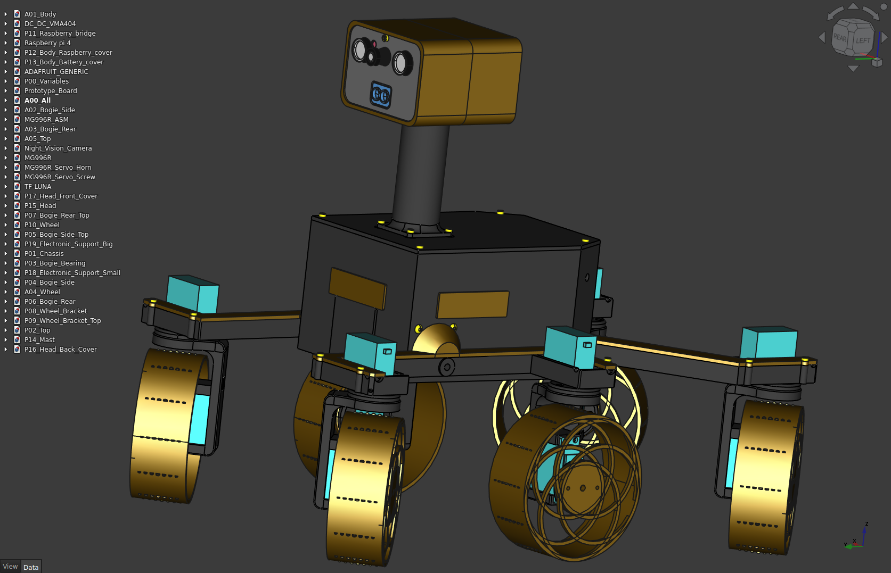

# Romgere's Exomy

Remote controlled (Wifi, 4g) 3D printed "Mars rover", inspired by [ESA - ExoMy project](https://github.com/esa-prl/ExoMy/)



# What changed

Here is a brief summary of what's change comparing to [original ExoMy project](https://esa-prl.github.io/ExoMy/) :

- Move rover code & UI app in this single mono-repo
- Code source re-write :
  - Rover: Get rid of ROS & convert rover code typescript.
  - Control app: Rewrite with [Ember.js](https://emberjs.com/) framework, add feature (Game controller support, new rover feature support, ...)
- Add feature to rover :
  - Add cheap servo workaround
  - Send some measure from raspberry PI (Network quality, vcgencmd infos, ...)
  - Allow live camera settings update
  - Add some HTTP response (ping) to better deal with rover connection.
  - add sensor to rover & display values in UI (Lidar, Proximity, Magnetometer, Gyroscope)
- Native ROS gamepad support has been replaced by using gamepad Api on UI app.
- Improvement of control app UI
- Convert all SolidWorks files to FreeCAD files & do a complete rewrite of the rover parts (see [Mechanical design Readme](./MechanicalDesign/README.md))
- More to come, see [todo](#todo)

# TODO

## Software

- Improve config script
- Improve logger & make critical logs available in UI
- Secure rover connection
- handle 4G hat, GPS position & init SMS

## Hardware

- Convert mast to a 2D moving camera holder

## Various

- Export some list & link to used component (battery, 4g hat, sensor) & ensure other can build the rover
- plug arduino to raspberry with I2C & start with sending LiPO battery voltage ?

# Know issues

- Proximity sensors boxes need a re-design (proximity sensor lifght signal hit box & result in poor "far object" detection)
- New body height is still a bit small (servo connectors are a bit bended by top)

# My ExoMy Project Structure

### `packages/ControlCenter` folder (`@robot/control-center`)

Contains the web app used to control the ExoMy Robot

### `packages/RoverApp` folder (`@robot/rover-app`)

Robot software aims to be run on Rapsberry

### `packages/Shared` folder (`@robot/shared`)

Package to share types/code from control app & Robot software

### `Docker` folder

Contains the docker file & usefull stuff related to docker

### `ElectricalDesign` foler

Contains Fritzing schema of the robot

### `MechanicalDesign` folder

Contains freecad file of the robot design

### `Misc` folder

Various usefull stuff (personnal purchase list, freecad macro, ...)

# Configure Raspberry Pi

### Start from fresh install

### Enable Camera, SSH and I2C

run `sudo raspi-config` & ensure Camera, SSH & I2C are enable.

### OS update

`apt-get update && sudo apt-get full-upgrade`

### Install docker

```sh
curl -fsSL https://get.docker.com -o get-docker.sh
sudo sh get-docker.sh
sudo usermod -aG docker pi
sudo reboot now
```

(Optional) test docker installation with :
`docker run hello-world`

### Get Source Code

```sh
cd
git clone https://github.com/romgere/MyExoMy.git
```

### Run Docker Containers

To see the different options of the script use:

`sh ~/MyExoMy/Docker/run_exomy.sh -h`

Or if you are already in the `MyExoMy/Docker` folder:

`sh run_exomy.sh -h`

Depending on the state of the project, different configurations of the docker container are used:

#### Config

This configuration is used to run configuration scripts for the motors as described in the chapter final integration

`sh ~/MyExoMy/Docker/run_exomy.sh -c`

Then, you can run `yarn start` to start the rover app.

#### Devel

This configuration is used to start the container for development purposes. It installs the source code and sources the environment. You can make modifications to the code and run your custom launch files.

`sh ~/MyExoMy/Docker/run_exomy.sh -d`

#### Autostart

This configuration is used to autostart the software when ExoMy is switched on. ExoMy can then be controlled using the website or with a gamepad.

`sh ~/MyExoMy/Docker/run_exomy.sh -a`

Stop Autostart This configuration is used to stop the autostart docker container.

`sh ~/MyExoMy/Docker/run_exomy.sh -s`

### Tips

Edit source files from raspberry directly on your computeur :

```sh
apt-get install sshfs
cd
mkdir pi_home
sshfs -o allow_other,default_permissions pi@xxx.xxx.xxx.xxx:/home/pi pi_home/ # replace xxx.xxx.xxx.xxx by your raspberry address
cd pi_home/MyExoMy #Open this folder in your IDE
```
